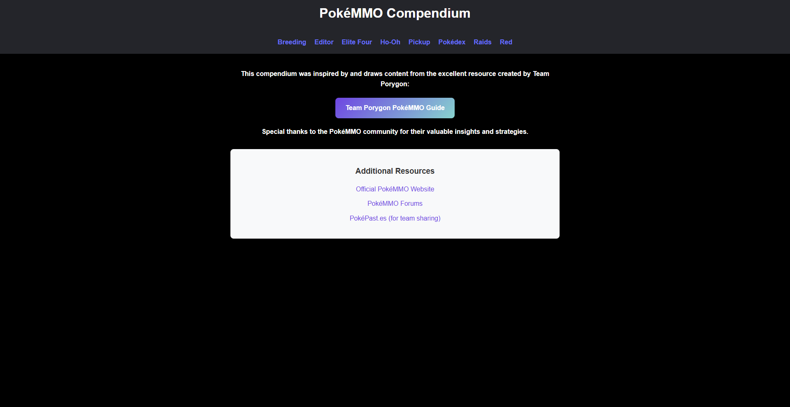
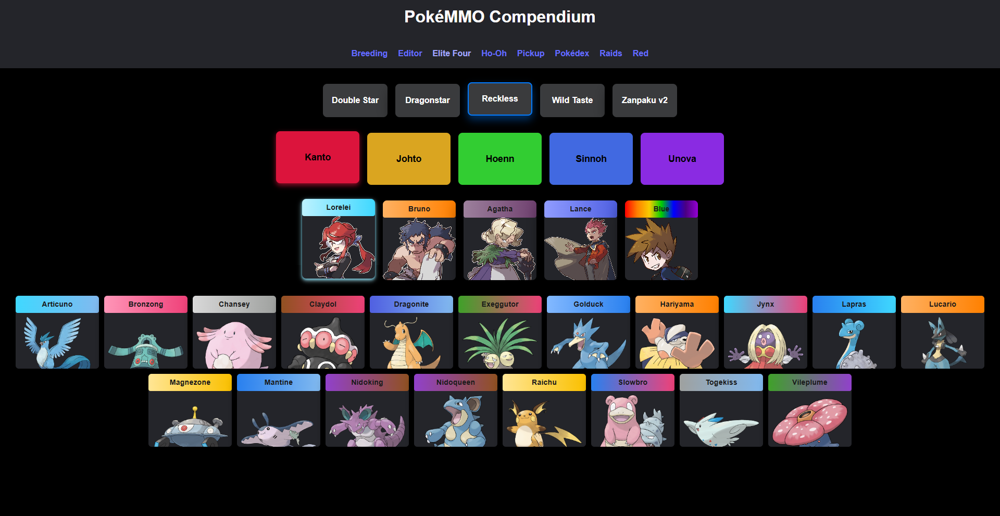
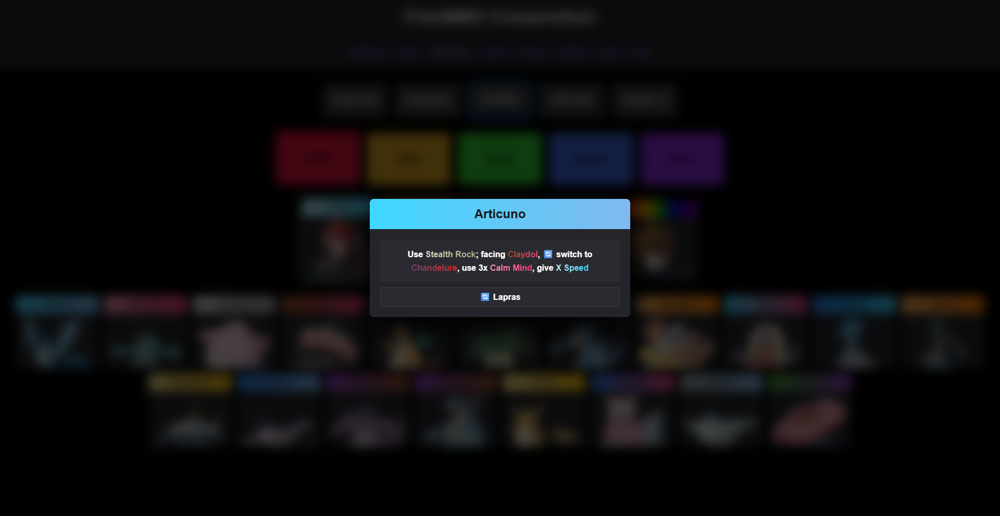
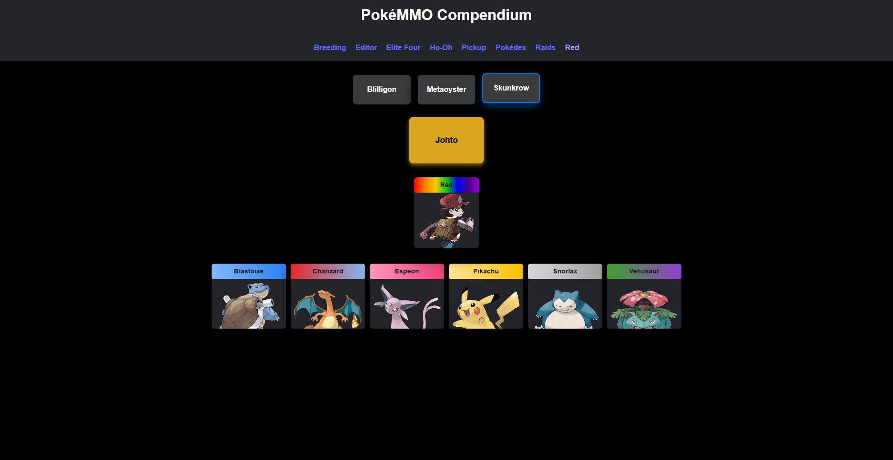

# 🏆 PokéMMO Compendium

**Your Ultimate Interactive Guide to Mastering PokéMMO**

Welcome to the PokéMMO Compendium — your comprehensive, step-by-step companion for conquering the most challenging battles and mastering essential game mechanics. Whether you're facing the Elite Four, breeding perfect Pokémon, or optimizing your farming strategies, this guide provides detailed, battle-tested approaches used by top players.

## 🎯 What This Guide Offers

- 🏆 **Elite Four Dominance**: Complete walkthroughs for every region with proven team compositions and turn-by-turn strategies
- 🧬 **Breeding Mastery**: Advanced IV and nature inheritance tools to breed competitive Pokémon
- ⚔️ **Battle Strategies**: Detailed guides for Red, Ho-Oh, and raid encounters
- 🛠️ **Game Mechanics**: Deep dives into Pickup farming, Pokédex completion, and efficiency optimization
- 📱 **Mobile-First Design**: Clean, responsive interface that works perfectly on any device
- ✏️ **Enhanced Content Editor**: A radically improved local CMS interface for maintaining and expanding all guide content with ease.

**Walk through each challenge with confidence** — every strategy includes emoji-annotated battle sequences, item recommendations, and alternative approaches for different playstyles.

---

## ⚡ Status


---

## 📸 Screenshots

### 🌐 Frontend Overview

#### 🏠 Landing Page



#### 🧬 Breeding


#### ✏️ Strategy Editor (Radically Improved!)


_Note: The editor interface has been significantly enhanced for better usability and visual feedback, including drag-and-drop, smart input fields, and collapsible sections._

#### 🏆 Elite Four Challenges



- **🗺️ Strategy Decision Tree**



#### 🔥 Legendary Encounters - Ho-Oh


#### 🎯 Pickup Farming


#### 📚 Pokédex Database


#### ⚔️ Raid Battles


#### 🎮 Red Battle



---

## ⚔️ Emoji Legend for Elite Four and Red

This legend decodes the emojis used in the step-by-step battle strategies throughout the compendium.

| Emoji | Meaning               | Context                                                                                  |
| ----- | --------------------- | ---------------------------------------------------------------------------------------- |
| 💥    | **Damage Move**       | A move that deals damage (Physical or Special).                                          |
| 🔒    | **Locking Move**      | A move that prevents the enemy from switching or locks them in (e.g., Mean Look, Block). |
| 🎒    | **Generic Held Item** | Represents any standard held item (e.g., Leftovers, Choice Band).                        |
| 🔄    | **Switch Pokémon**    | The optimal time to switch to another Pokémon in your party.                             |
| ⬇️    | **Stay In**           | Instructs you to keep your current Pokémon in battle.                                    |

---

## 📁 Project Structure

```bash
/pokemmo-compendium
├── /public
├── /screenshots
├── /server
│   ├── server.js
├── /src
│   ├── /app
│   │   ├── App.jsx
│   │   ├── index.css
│   │   └── layout
│   │       ├── Home.jsx
│   │       └── Shell.jsx
│   │       └── Sidebar.jsx
│   ├── /data
│   │   ├── bossFightsData.json
│   │   ├── eliteFourData.json
│   │   ├── pokedex.json
│   │   ├── raidsData.json
│   │   └── superTrainersData.json
│   ├── /pages
│   │   ├── boss-fights
│   │   │   ├── BossFightsPage.jsx
│   │   │   └── data
│   │   │       └── bossFightsService.js
│   │   ├── breeding
│   │   │   ├── BreedingPage.jsx
│   │   │   └── components
│   │   │       ├── IVsDropdown.jsx
│   │   │       ├── IVsSelector.jsx
│   │   │       ├── StatCircle.jsx
│   │   │       └── TreeScheme.jsx
│   │   ├── editor
│   │   │   ├── EditorPage.jsx
│   │   │   └── components
│   │   │       ├── EditorSidebar.jsx
│   │   │       ├── EliteFourEditor.jsx
│   │   │       ├── EliteFourMemberCard.jsx
│   │   │       ├── EliteFourTeamOverview.jsx
│   │   │       ├── PickupEditor.jsx
│   │   │       ├── PokedexEditor.jsx
│   │   │       ├── RaidsEditor.jsx
│   │   │       ├── RedEditor.jsx
│   │   │       ├── SortableNestedStepItem.jsx
│   │   │       ├── SortableStepItem.jsx
│   │   │       ├── StepForm.jsx
│   │   │       ├── UniversalJsonEditor.jsx
│   │   │       └── VariationForm.jsx
│   │   ├── elite-four
│   │   │   ├── EliteFourPage.jsx
│   │   │   ├── TeamBuildModal.jsx
│   │   │   └── data
│   │   │       ├── elite4Template.js
│   │   │       └── eliteFourService.js
│   │   ├── pickup
│   │   │   └── PickupPage.jsx
│   │   ├── pokedex
│   │   │   ├── PokedexPage.jsx
│   │   │   └── data
│   │   │       └── pokemonService.js
│   │   ├── raids
│   │   │   ├── RaidsPage.jsx
│   │   │   ├── components
│   │   │   │   └── RaidCard.jsx
│   │   │   └── data
│   │   │       └── raidsService.js
│   │   └── super-trainers
│   │       ├── SuperTrainersPage.jsx
│   │       └── data
│   │           └── superTrainersService.js
│   └── /shared
│       ├── components
│       │   ├── EliteMemberCard.jsx
│       │   ├── MoveColoredText.jsx
│       │   ├── PageTitle.jsx
│       │   ├── PokemonCard.jsx
│       │   ├── PokemonSummary.jsx
│       │   ├── RegionCard.jsx
│       │   └── ToastNotification.jsx
│       ├── hooks
│       │   └── usePokedexData.js
│       └── utils
│           ├── pokemonColors.js
│           ├── pokemonImageHelper.js
│           ├── pokemonMoveColors.js
│           ├── pokedexDataExtraction.js
│           ├── regionData.js
│           ├── typeUtils.js
│           └── usePersistentState.js
├── index.html
├── jsconfig.json
├── LICENSE
├── package-lock.json
├── package.json
├── README.md
└── vite.config.js
```

---

## 💡 Inspiration & Credits

This compendium serves as a community-driven guide for **PokéMMO** players — gathering essential data and strategies to assist in breeding, team building, and late-game encounters such as the Elite Four and Red.

It stands as a collaborative effort shaped by countless trainers, creators, and guide writers across the PokéMMO community. Below are the main sources that inspired and supported this project.

### Primary Resources Consulted

- **Breeding & Pokédex**: Inspired by [PokéMMO Hub](https://pokemmohub.com/).
- **Elite Four, Red & Ho-Oh**: Strategies adapted from [Team Porygon PokéMMO Guide](https://team-porygon-pokemmo.pages.dev/guides/EliteFour) and [PokeKing](http://pokeking.icu/).
- **Raids**: Based on the content from [caav](https://www.youtube.com/@caav.pokemmo) YouTube Channel.
- **Pickup**: Mechanics sourced from [PokéMMO ShoutWiki](https://pokemmo.shoutwiki.com/wiki/PokeMMO_Wiki:Main_page).

---

## 🗺️ Development Roadmap & TODO

### 🚀 New Feature Development

- **Develop Ho-Oh Page**: Create a dedicated page for the Ho-Oh encounter, detailing strategy, team composition, and rewards.
- **Develop PokédexPage**: Build an interactive Pokédex filterable by region, type, and stats.
- **Develop PickupPage**: Create a utility page showing Pickup tables and optimal farming locations/parties.

### ♻️ Code Quality & Infrastructure

- **Integrate Tailwind CSS**: Systematically convert existing plain CSS to Tailwind CSS for better maintainability and a more consistent design system. This includes:
  - Convert App.css and component-specific CSS to Tailwind utility classes.
  - Configure the Tailwind theme to match the existing color scheme.
  - Ensure responsive design is maintained or improved with Tailwind's breakpoints.
- **Expand Team Options**: Add more team variations to the Elite Four, Red, and raid guides to accommodate diverse strategies and playstyles.

### 🌍 Future Enhancements

- **Add Multilingual Support**: Implement i18n for broader accessibility (e.g., English, Italian).

---

## ©️ License

This project is released under the [Unlicense](http://unlicense.org/).
This means it is free and unencumbered software released into the public domain. You can copy, modify, publish, use, sell, or distribute this software for any purpose, commercial or non-commercial, and by any means.

---

## 📬 Contact

For questions, suggestions, or collaborations, feel free to reach out via GitHub.
