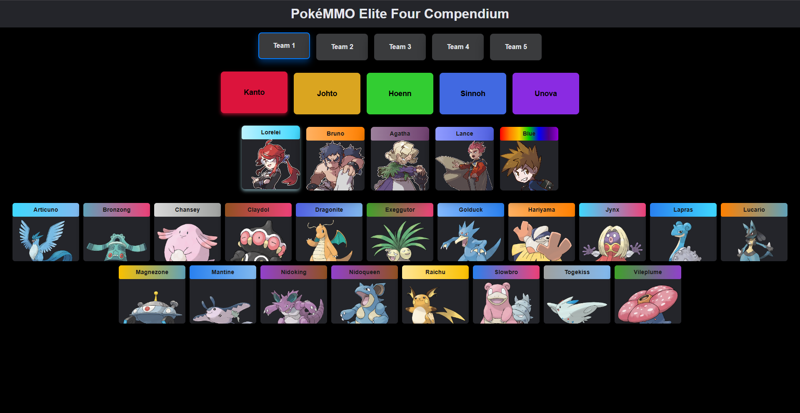
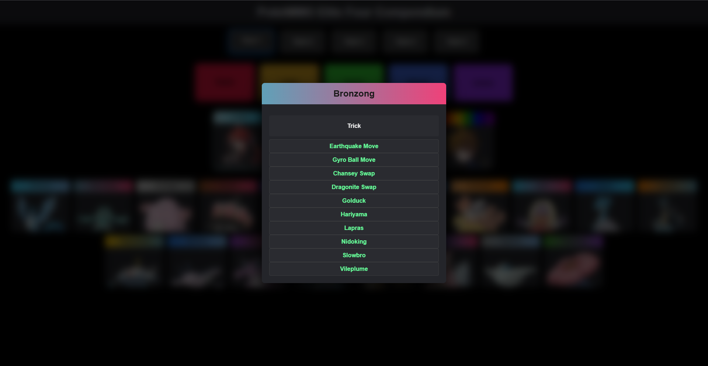

# 🏆 Pokemmo Elite 4 Compendium

An **interactive and detailed guide** to help players defeat the Elite Four in **Pokemmo**.  
Walk step-by-step with tips, strategies, and suggested teams for each Pokémon League.

---

## ⚡ Status


---

## 📸 Screenshots

### 🌐 Frontend

#### 🏠 Homepage


#### 🔍 Pokémon Selection


---

## ⚔️ Emoji Legend for Pokémon Battle Guide

### 🐾 Pokémon Icons
| Emoji | Meaning |
|-------|---------|
| 🥚 | Blissey |
| 🕯️ | Chandelure |
| 🐚 | Cloyster |
| 🐹 | Excadrill |
| 🤖 | Metagross |
| 🐸 | Poliwrath |
| 🦎 | Scrafty |

### 📜 Move Categories

#### 🔹 Damage & Healing
| Emoji | Meaning |
|-------|---------|
| 💥 | Damage Move (physical/special) |
| ✨ | Healing Move |

#### 🔹 Status Moves (Opponent)
| Emoji | Meaning |
|-------|---------|
| ☠️ | Harmful Status (poison, burn, paralysis) |
| 📉 | Stat Debuff (opponent’s stats down) |

#### 🔹 Field / Hazards
| Emoji | Meaning |
|-------|---------|
| 📌 | Stealth Rock |

#### 🔹 Buffs & Setup
| Emoji | Meaning |
|-------|---------|
| 🥁 | Belly Drum |
| 🧠 | Calm Mind |
| 🐉 | Dragon Dance |
| 🦀 | Shell Smash |
| ⚔️ | Swords Dance |

#### 🔹 Utility
| Emoji | Meaning |
|-------|---------|
| 🔁 | Item Swap (Trick, Switcheroo) |

### 🎒 Items
| Emoji | Meaning |
|-------|---------|
| 👓 | Choice Specs |
| 🩹 | Focus Sash |
| 🍽️ | Leftovers |
| 🔮 | Life Orb |
| 🥋 | Expert Belt |
| ⛑️ | Rocky Helmet |
| 🎒 | Generic Item |
| 🧪 | X-Item / Special Battle Item |
| 💊 | Healing Item (Potion, Full Restore) |
| 📦 | Miscellaneous Item |

### 🔄 Switching & Actions
| Emoji | Meaning |
|-------|---------|
| 🔄 | Switch Pokémon |
| ✔️ | Stay In (no switch) |
| ❓ | Conditional Action (if …) |

### 🛡️ Roles
| Emoji | Meaning |
|-------|---------|
| 🛡️ | Tank / Wall (damage/status absorber) |

---

## 📁 Project Structure

```bash
/pokemmo-elite4-compendium
├── /src
│   ├── /assets
│   ├── /components
│   │   ├── EliteMemberCard.jsx
│   │   ├── PokemonCard.jsx
│   │   ├── RegionCard.jsx
│   ├── /data
│   │   ├── eliteFourData.jsx
│   │   ├── pokemonColors.jsx
│   │   ├── pokemonData.jsx
│   │   ├── pokemonImages.jsx
│   │   ├── regionData.jsx
│   ├── App.css
│   ├── App.jsx
│   ├── index.css
│   └── index.jsx
├── tailwind.config.js
└── package.json
```

---

## 💡 Inspiration

This project was inspired by an existing online Pokemmo Elite Four guide.  
While that resource provided a starting point, I felt there was room for a more user-friendly, interactive, and visually appealing experience — especially for mobile users.

This compendium was built to improve clarity, accessibility, and strategy organization for players across all regions.

---

## 🔮 TODO

* [ ] Fully integrate Tailwind CSS for consistent and modern UI styling
* [ ] Develop full route coverage and strategic breakdowns for each region (Kanto, Hoenn, Sinnoh, Unova)
* [ ] Expand team options to accommodate diverse strategies and playstyles
* [ ] Add multilingual support (e.g., English, Italian) for broader accessibility

---

## ©️ Copyright

This project is **not open source**.
All content, code, and media are protected by copyright and may not be copied, modified, or distributed without explicit permission from the author.

---

## 📬 Contact

For questions, suggestions, or collaborations, feel free to reach out via GitHub.
