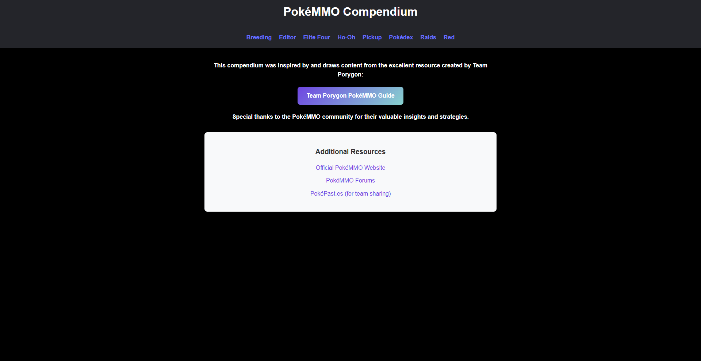
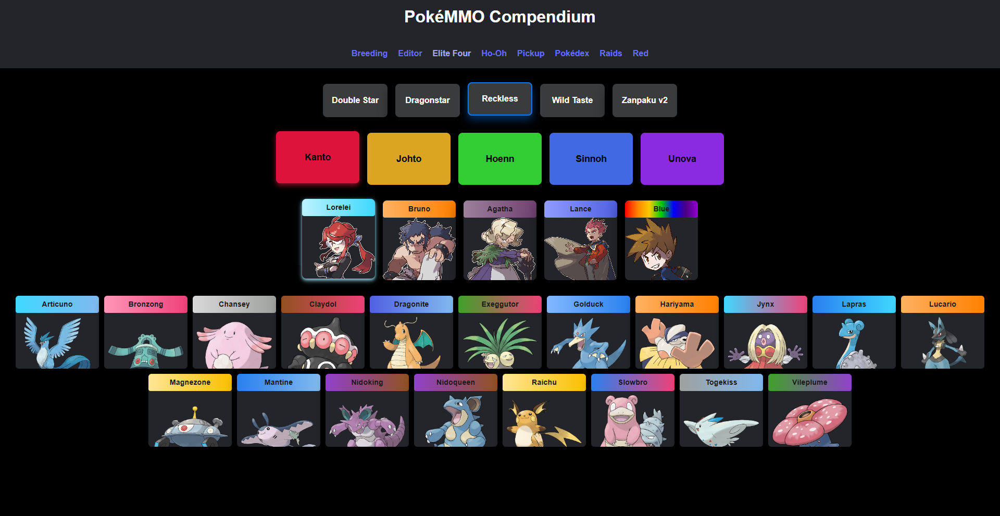
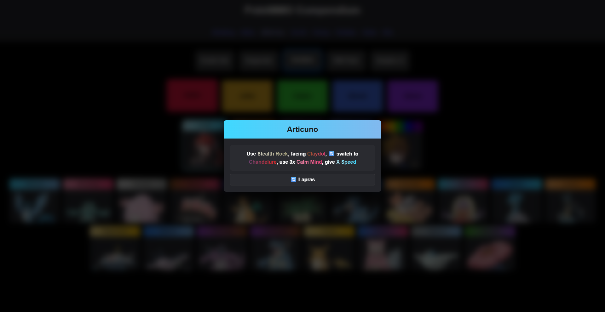

# 🏆 PokéMMO Compendium

**Your Ultimate Interactive Guide to Mastering PokéMMO**

Welcome to the **PokéMMO Compendium** — your comprehensive, step-by-step companion for conquering the most challenging battles and mastering essential game mechanics. Whether you're facing the Elite Four, breeding perfect Pokémon, calculating catch rates, or optimizing your farming strategies, this guide provides detailed, battle-tested approaches used by top players.

## 🎯 What This Guide Offers

### ⚔️ Battle Strategies & Walkthroughs

- **🏆 Elite Four**: Complete walkthroughs for every region (Kanto, Johto, Hoenn, Sinnoh, Unova) with proven team compositions and turn-by-turn strategies.
- **💀 Boss Fights**: Detailed guides for major boss encounters (Red, Ho-Oh, etc.), including enemy team analysis and optimal counters.
- **⚔️ Super Trainers**: Strategies to defeat the toughest NPC trainers in the game.
- **🤝 Raids**: Comprehensive raid guides with star-level filtering, role-based turn strategies, recommended builds, and mechanic breakdowns (HP thresholds, abilities).

### 🧰 Tools & Calculators

- **🧬 Breeding Planner**: Advanced calculator to determine the most efficient path for breeding 2x31, 3x31, or 5x31 competitive Pokémon, complete with cost visualization.
- **🧮 Catch Calculator**: Real-time probability calculator supporting all ball types, status conditions, HP percentages, and special ball mechanics (Dream, Nest, Timer Ball).
- **🔄 Trainer Reruns**: Optimized routes for Gym Runs and Trainer Reruns to maximize money making, including requirements and tips.
- **📦 Pickup Guide**: Searchable data on pickup items by region and location.
- **📚 Pokédex**: Fast, filterable database of Pokémon with sprites and basic info.

### ⚡ Technical Features

- **📱 Mobile-First Design**: Clean, responsive interface that works perfectly on any device.
- **🔐 User Data (Firebase)**: Features like "My Teams" allow authenticated users to create, save, and manage their own custom teams and strategies using Firebase Firestore. Data like Boss Fights and Pokédex are also managed via Firestore for easier updates.
- **🌐 Dynamic Base URL Handling**: Supports different base URLs for local development and GitHub Pages deployment.
- **🔄 Workflow & Versioning**: Structured use of GitHub Labels and Semantic Versioning (see [WORKFLOW.md](./docs/WORKFLOW.md)).

---

## ⚡ Status


---

## 📸 Screenshots

### 🌐 Application Overview

#### 🏠 Landing Page



### ⚔️ Battle Strategies & Walkthroughs

#### 🏆 Elite Four Strategies


_Interactive decision trees for every turn of the battle._


#### 💀 Boss Fights


_Detailed guides for major boss encounters._

#### ⚔️ Super Trainers


_Strategies to defeat the toughest NPC trainers._

#### 🤝 Raids


_Comprehensive raid guides with star-level filtering and role-based strategies._

### 🧰 Tools & Calculators

#### 🧬 Breeding Planner


_Advanced calculator for breeding competitive Pokémon._

#### 🧮 Catch Calculator


_Real-time probability calculator for catching Pokémon._

#### 🔄 Trainer Reruns


_Optimized routes for Gym Runs and Trainer Reruns._

#### 📦 Pickup Guide


_Searchable data on pickup items by region and location._

#### 📚 Pokédex


_Fast, filterable database of Pokémon with sprites and basic info._

### ✨ User-Specific Features & CMS

#### 🔐 My Teams (User-Specific Team Builder)


_Create, save, and manage your own custom teams and strategies._

_Advanced editor for building and refining user teams._

---

## 📁 Project Structure

```bash
/
├── dist/               # Production build output
├── public/             # Static assets (images, icons)
├── src/
│   ├── app/            # Core app logic
│   │   ├── App.tsx     # Main component & routing logic
│   │   ├── index.css   # Global styles & Tailwind directives
│   │   ├── main.tsx    # Entry point and Router configuration
│   ├── firebase/       # Firebase configuration and service layer
│   │   ├── config.ts   # App initialization
│   │   └── firestoreService.ts # CRUD operations for My Teams and Game Data
│   ├── pages/          # Feature-specific pages
│   │   ├── auth/       # Authentication (Login/Signup)
│   │   ├── boss-fights/      # Strategies for Bosses
│   │   ├── breeding/         # Breeding Calculator
│   │   ├── catch-calculator/ # Catch Rate Calculator
│   │   ├── elite-four/       # Elite Four Strategies
│   │   ├── my-teams/         # User-specific Team Builder
│   │   ├── pickup/           # Pickup Item Guide
│   │   ├── pokedex/          # Pokémon Database Viewer
│   │   ├── raids/            # Raid Battle Strategies
│   │   ├── super-trainers/   # Super Trainer Strategies
│   │   └── trainer-rerun/    # Gym Run / Money Making Routes
│   ├── components/     # UI components (Atomic Design)
│   ├── context/        # Global state and providers
│   ├── hooks/          # Custom React hooks
│   ├── services/       # API and data services
│   ├── constants/      # App constants
│   └── utils/          # Helper functions
├── .prettierrc         # Prettier configuration
├── eslint.config.js    # ESLint configuration
├── package.json        # Dependencies and scripts
└── vite.config.ts      # Vite configuration
```

---

## 🚀 Getting Started

### Prerequisites

- **Node.js** (v18+ recommended)
- **npm** (v9+) or Yarn

### Installation

1.  **Clone the repository:**
    ```bash
    git clone https://github.com/SolaneHub/PokeMMO-Compendium.git
    cd PokeMMO-Compendium
    ```
2.  **Install dependencies:**
    ```bash
    npm install
    ```

### Running Development Environment

```bash
npm run dev
```

- **Frontend**: `http://localhost:5173`

### Building for Production

```bash
npm run build
```

This compiles the application into the `dist/` directory, ready for deployment.

### Linting & Formatting

```bash
npm run lint         # Check for code quality issues
npm run lint:fix     # Auto-fix issues
npm run format       # Format code with Prettier
```

---

## 💡 Inspiration & Credits

This compendium is a community-driven effort to aggregate knowledge for **PokéMMO** players.

- **Breeding & Pokédex**: Inspired by concepts from [PokéMMO Hub](https://pokemmohub.com/).
- **Elite Four, Red & Ho-Oh**: Strategies adapted from [Team Porygon](https://team-porygon-pokemmo.pages.dev/guides/EliteFour) and [PokeKing](http://pokeking.icu/).
- **Raids**: Based on content from the [caav](https://www.youtube.com/@caav.pokemmo) YouTube Channel.
- **Pickup**: Data sourced from [PokéMMO ShoutWiki](https://pokemmo.shoutwiki.com/).

---

## ©️ License

This project is released under the **[Unlicense](http://unlicense.org/)**.
It is free and unencumbered software released into the public domain. You can copy, modify, publish, use, sell, or distribute this software for any purpose, commercial or non-commercial.
